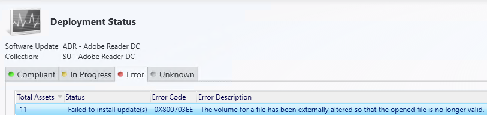
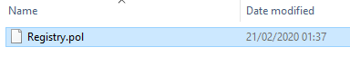
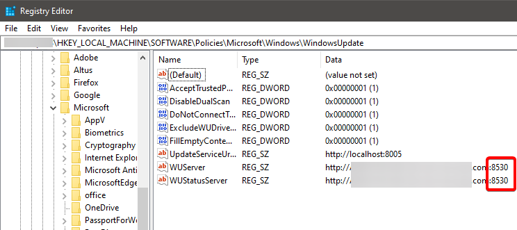

Recently when deploying 3rd Party Updates for Adobe Reader with Config Manager, I came across a bizarre error.

After a quick search online, one post suggested deleting the `\\machine\admin$\System32\GroupPolicy\Machine\Registry.pol`

I don't like deleting registry things, so it's better to rename it.

But why? What has group policy got to do with Updates Deployments since Config Manager Client sets the Windows Update settings in Registry.

Lets look at the facts

1.  The POL file date is 2 months old.

2. In the registry, it shows the WUServer is using the old ports. We changed this a few months ago.

So it seems like somehow this dead POL file could be preventing CMClient from updating the registry correctly.

Rename the the `Registry.pol` to `Registry.pol.old`

Restart CCMEXEC Service

Run the Software Updates Deployment Evaluation Cycle

If we monitor the WUAHandler.log on the target machine, it shows the update source changing the use the correct secure port: 8531.  
And in UpdateDeployment.log, I see it validating the WSUS Certificate it was supposed to have. And the updates start pouring in. 