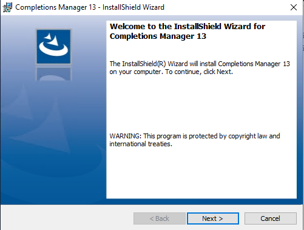

# InstallShield Setups
When running InstallShield setups, they usually have this icon:


And the setup dialogue looks like this:



These setup files are often a Setup.exe. There are two types; InstallScript and InstallScript MSI.
- **InstallScript MSI** - Setup.exe has InstallScript inside that drives the install of an MSI.
**NOTE** - *Don't be fooled into thinking you can just run the MSI - The Setup.exe will likely also run some other pre-requisite checks, custom actions, and/or post installation actions.*

- **InstallScript** - Setup.exe is a fully scripted install of the application.

## Parameters used for silent installs:

TIP: [installshield parameters](https://duckduckgo.com/?q=installshield+parameters&ia=web)

If lucky, InstallShield setup can be installed silently by just passing the /S parameter. (Uppercase S)

`Setup.exe /S`

If it's an InstallShield wrapped MSI, you'll need to supply the /v parameter to pass command line options to MSIEXEC for the MSI.

`Setup.exe /S /v/qn`

*Note: No space after `/v`*


## Known Issue

There was one issue that I came up against a few times when running an InstallShield application silently with the following command:

`setup.exe /S /v/qn`

The installation appeared to start, but then failed silently.

Setup.log file was created in the same directory as setup.exe with the following contents:
```
[ResponseResult]
ResultCode=-3
```
Or
```
[ResponseResult]
ResultCode=-5
```

### Resolution

A response file (setup.iss) needs to be created in the same directory as setup.exe.

- Run `setup.exe /r`
- Complete the install process
- Copy **%SystemRoot%\setup.iss** to the same location as **setup.exe**

The silent installation path above should now complete successfully.

The `/f1` command line parameter can be used to specify the location of the setup.iss


## References

Silent Installations
<http://www.appdeploy.com/tips/detail.asp?id=18>

- `/p` : Specify password
- `/r `: Record mode (InstallScript and InstallScript MSI projects only)
- `/s `: Silent mode
- `/f1 `: Specify alternative response file name (InstallScript and InstallScript MSI projects only)
- `/f2 `: Specify alternative log file name (InstallScript and InstallScript MSI projects only)