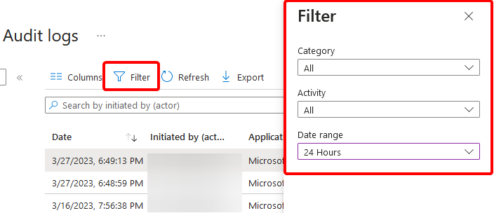
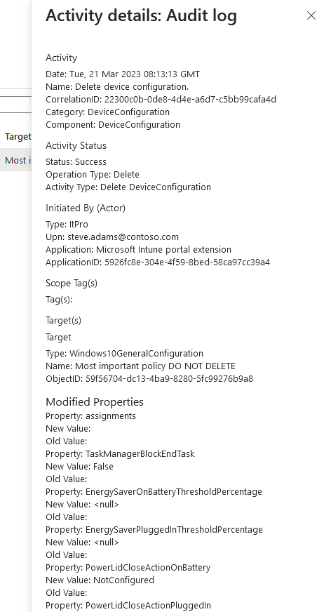

Find who created/deleted/modified a configuration profile

Not that we operate in a blame culture and I'm sure you don't either, but sometimes you need to know who created, deleted, or modified a configuration profile because *sometimes* people need hit with a jabby stick!

# Intune Audit Logs
In Intune, we have some lovely Audit Logs under Tenant administration.


## Permissions
To access and review Audit log data, you'll need to be in one of the following roles:
- Global Administrator
- Global Reader (*Not mentioned in Microsoft Learn*)
- Intune Administrator
- Custom Intune role with Intune role with **Audit data** - **Read** permissions

## Example
In the example for this post, we'll be looking for who deleted a very important device configuration profile, but there are many other areas you can filter on.

By default, Audit logs shows the activity for the last 24 hours.

The columns shown are:
| Column               | Description                                |
| -------------------- | ------------------------------------------ |
| Date                 | and time of offence                       |
| Initiated by (actor) | whodunnit                                  |
| Application name     | See if it was done in Intune or PowerShell |
| Activity             | What they did                              |
| Target               | What they broke                            |
| Category             | Where it's broken                          |

If we click on **Filter** on the top row we can chose a **Category**, **Activity**, and **Date range**


We'll filter for:  
Category: **DeviceConfiguration**  
Activity: **Delete DeviceConfiguration**  
Date range: **1 Year** *(this is the maximum)*  

Once we click Apply at the bottom of the filter pane, we can now see all the Deletes of Device Configuration profiles in the last year...and our culprit!


Clicking on the result, we'll be able to drill into some verbose details about the activity.  
If we were looking for a modified Configuration Profile, we'd be able to see the in Modified Properties what was actually changed. Very handy indeed! Especially if we have to revert a change our colleague did on a Friday afternoon before taking 2 weeks vacation...   


# The PowerShell way

Clicky clicky is good for some, but we all need to get our Graph on, so lets dig through this the PowerShell way.

## Permissions
You'll need one of the following permissions in the Microsoft Intune PowerShell Enterprise App:  
- DeviceManagementApps.Read.All
or
- DeviceManagementApps.ReadWrite.All

## Module
You'll need the Microsoft Graph PowerShell SDK
https://learn.microsoft.com/en-us/powershell/microsoftgraph/installation?view=graph-powershell-beta

## Code
To get the same filtered results, we'll use the following:
```powershell
Select-MgProfile beta

Connect-MgGraph -Scopes DeviceManagementApps.Read.All

Get-MgDeviceManagementAuditEvent -Filter "Category eq 'DeviceConfiguration' and ActivityType eq 'Delete DeviceConfiguration'"
```

