I'll start off by saying I don't fully understand what I've done here. This whole process stemmed from having to do some *icky* dev stuff in order to keep my Intune Dev tenant active. 

_I still find it unbelievably moronic that MS don't provide a tenant for testing Intune without forcing us to do dev stuff to keep it active - I'm on my 4th tenant now and it's a PITA setting everything up again._

To get started, I read and followed a couple of blogs which were many years out of date except one which was from 2023 but was not written for the layman, so many steps were missing.

I used Mark Hoppers post on [Using Power Automate to notify admins on Intune Connector health](https://techcommunity.microsoft.com/t5/intune-customer-success/using-power-automate-to-notify-admins-on-intune-connector-health/ba-p/2274944) as the basis of my foray into low-code dev stuff.
The idea of getting alerts into Teams if a certificate connector is down spoke volumes to me considering the firewall team at my client have a habit of breaking things and we don't find out until days/weeks later.

**NOTE:** *This post shows setting up a development environment for Power Apps. Custom connectors in a production environment requires ridiculously expensive Power Automate Premium licenses.*

# Power Apps Developer Plan
We have our M365 Dev tenant, now we also need a dev plan for Power Apps so we can use premium custom connectors.

**NOTE:** *This process is correct at time of writing. Microsoft may change the UI at any time. This is why no screenshots are recorded.*

- Open https://powerapps.microsoft.com/en-us/developerplan/
- Click **Get started free**
- Enter the email of your chosen account in your dev tenant.
	- If it shows "Looks like you're already a Microsoft customer..." continue by signing in.
- Select your country and a fake phone number
- Uncheck all the crap and click Get Started

Once into Power Apps, you'll see you have two environments, your new developer environment, and the default tenant environment which only allows free stuff.
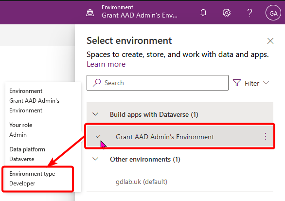

# Create App Registration
Our custom connector will use Graph API to get info from Intune. To do so, we need to make a App Registration with delegated permissions. It hasn't fully clicked with me what the difference between app permissions and delegate permissions are - but I do know that only delegated permissions worked.

Assuming it decides to work, log into https://entra.microsoft.com with an account that can manage app registrations - presumably you're using your GA account because fragmented permissions are pointless in a dev tenant.
- Navigate to Applications > App registrations
- Click **New registration**
- Give it a name. e.g. "Graph - Intune Cert Health Power Automate Connector"
- Leave the **Supported account type** as: "Accounts in this organizational directory only (gdlab.uk only - Single tenant)"
- Add a Redirect URI. *(Why? No one has explained this in any blog so I can't tell you. But we'll revisit this later)*
  - Type: Web
  - Value: https://global.consent.azure-apim.net/redirect
- Click **Register**

## So many permissions
Next we need to set up the delegated permissions to our newly created app registration.
- Open **API permissions** on the left pane.
- Remove the default "User.Read" permission as this is not needed in this instance.
- Click "Add a permissions"
- Select the giant **Microsoft Graph** box at the top. *I originally went scrolling through the list trying to find Graph, not realising that box was a button itself.*
- Choose **Delegated permissions**
- Find and select:
	- `DeviceManagementConfiguration.Read.All`
	- ~~DeviceManagementServiceConfig.Read.All~~

	These are the permissions needed for reading Intune Certificate connector details. [ **EDIT**: *`DeviceManagementServiceConfig.Read.All` isn't actually needed*]
- Once added, you now need to grant admin consent for them.
  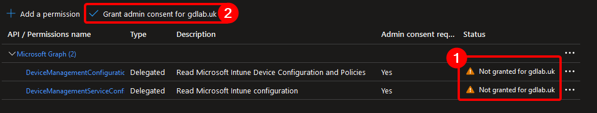

## Shhh it's a Secret
For the Power Automate connector to use the app registration, it needs a secret to talk to it.
- Open **Certificate & secrets** on the left pane.
- Click "New client secret" button
- Give it a description to give your future self an idea of where the secret was used, and expiry time. I left it on the default 180 days. *(Because you've got to make sure to generate work for your future self.)*
- Copy the **Value** (which is the secret) to notepad/keepass for later use.

# Create custom-connector

Lets head back to https://make.powerautomate.com and make sure we're in our development environment.
- On the left pane, select Custom connectors
	If it's not there, click **More > Discover all**, and pin **Custom connectors** from the **Data** list
- Click **New custom connector** at the trop right.
- Give it a name. e.g. Graph-Intune-Cert-Connector
## General
- If you're feeling fancy, set a connector icon and colour.
- Give it a description. "Retrieve Intune Certificate Connector info from Graph"
- Set **Host** to: **graph.microsoft.com**
- Click **Security ➡️**
## Security
Set the following options for security

**Authentication type**: `OAuth 2.0`  
**Identity Provider:** `Azure Active Directory`  
**Client ID**: `<Application (client) ID>`  *Get the "Application (client) ID" from your App Registration Overview*   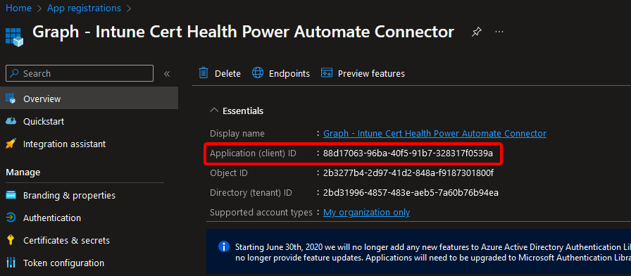  
**Secret**: `<secret>` *Enter the secret copied from earlier*
**Authorization URL**: `https://login.microsoftonline.com`  
**Tenant**: `<tenant ID>` *Enter your tenant ID. This can be seen in the app registration overview also. (Though I'm led to believe you can leave as "common")*  
**Resource URL**: `https://graph.microsoft.com`

Click **Definition ➡️**
## Definition
Here we set up what the connector actually does. 
Under **Actions**, click **New action**

**General**  
Give a summary, description, and Operation ID. I used a PowerShell-esq naming convention as that made sense to me: Get-IntuneCertificateConnectors  
Set the Visibility to "important".
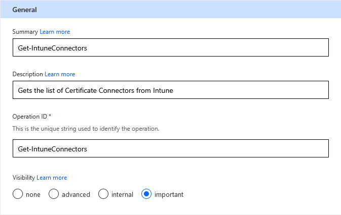

**Request**  
- Click **➕ Import from sample**
- Set **Verb** to 'GET'
- Enter the URL: `https://graph.microsoft.com/beta/deviceManagement/ndesConnectors`

**Response**  
This is what outputs you'll get from the query.  
To build this out, I used [Graph Explorer](https://developer.microsoft.com/en-us/graph/graph-explorer/) and tweaked my URL to select specific properties:  id, displayname, lastConnectionDateTime, and state.  
`https://graph.microsoft.com/beta/deviceManagement/ndesConnectors?$select=id,displayName,lastConnectionDateTime,state`  
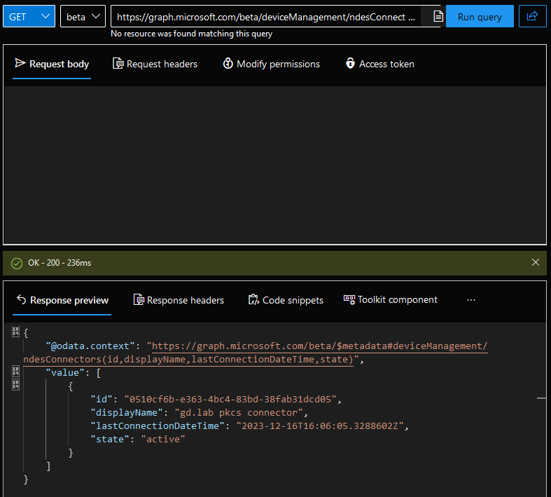
After running the query, copy the JSON from the **Response preview**

Back on the connector tab, click the default Response
- Click **➕ Import from sample**
- Paste the JSON into the **Body** field and click **Import**  
You should see that Body now shows the individual values returned from Graph and that Validation succeeded.
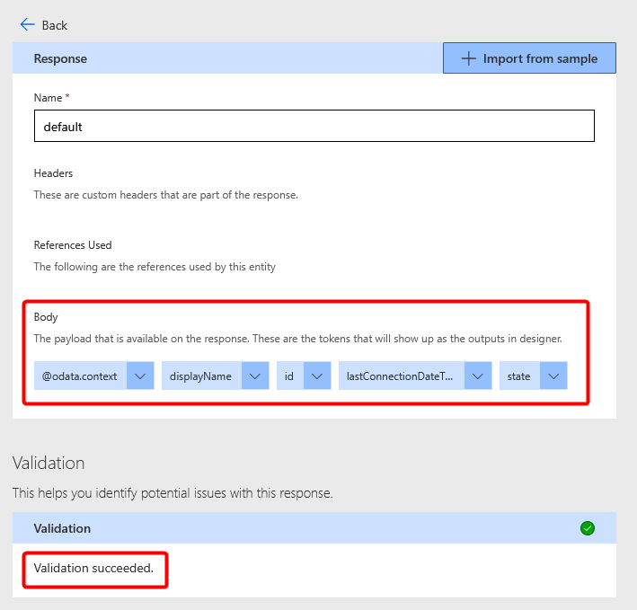

Finally, click ✔️ **Create connector** at the top right.

## Testing
Once the connector is saved, we can skip ahead and click on **6. Test**

- Click **➕New connection**
- Sign in with your account
- **Panic!**  

> AADSTS50011: The redirect URI 'https://global.consent.azure-apim.net/redirect/graph-2dintune-2dcert-2dconnector-5f8596d3e925c-71bc99fef67ae008' specified in the request does not match the redirect URIs configured for the application '88d17063-96ba-40f5-91b7-328317f0539a'.  
Make sure the redirect URI sent in the request matches one added to your application in the Azure portal.  
Navigate to https://aka.ms/redirectUriMismatchError to learn more about how to fix this.

What the hell does this mean?  
It means that the blog I originally followed about creating the App registration was wrong (or maybe was right at the time, but not anymore.)

- Go back to **2. Security** of your connector.
- Scroll down to "Redirect URL" and copy the value.
- Open a tab to the Entra App Registrations page and open the "Graph - Intune Cert Health Power Automate Connector" we created at the start.
- Select **Authentication** from the left pane.
- Under **Web, Redirect URI's**, change the URI https://global.consent.azure-apim.net/redirect that was put in earlier to the one copied from your connector.
  e.g. https://global.consent.azure-apim.net/redirect/graph-2dintune-2dcert-2dconnector-5f8596d3e925c-61bdf9fef67ae004
- Click **Save**

### Test 2: Electric Boogaloo
- Go back to the Power Automate tab and select **6. Test** again.
- Accept any Graph permissions
- Click **Test operation**

As we see here, I got a 200 response code and the Body shows details of my Intune Certificate connecter called "gd.lab pkcs connector"
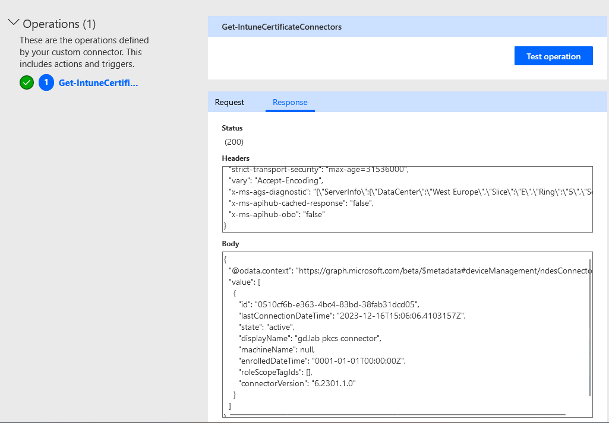

# Let the spice flow

Now it's time to put our new custom connector to use.  
For simplicity, I'm going to make a Flow that runs on a daily schedule that will check if any Intune Certificate connectors are not active and report to a Teams channel set up for Alerts.  
In prod, you might want the recurrence to run more often, perhaps every hour. Modify as you see fit.

Here's how my flow looks:
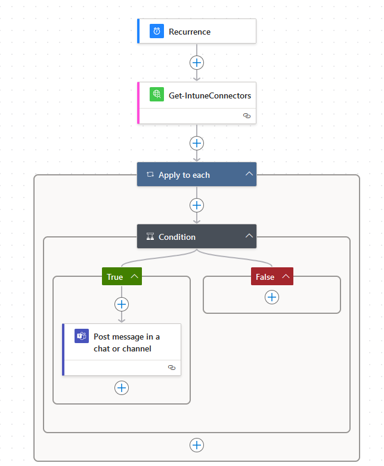

- In Power Automate, click ➕ **Create** and choose **Scheduled cloud flow**
- Give your flow a name. e.g. Intune Certificate Connector Healthcheck
- Start Time: 07:00 AM
- Repeat every 1 Day.
- Click **Create**
  
- Verify the Parameters on the Recurrence object so that it shows it runs at 7:00 every day. Mine didn't so I had to manually adjust.
  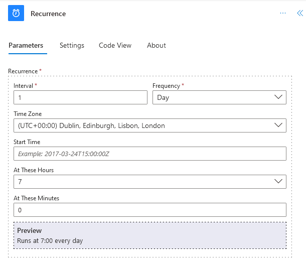

- Under Recurrence, click the ➕**Add an action**
- Change Runtime to **Custom** to see your custom connectors
  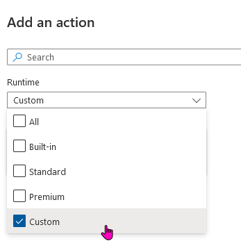
- Select your custom connector and add the Action "Get Certificate Connectors"

- Add another action below
	- Select **Control** > **Apply to each**
	  Think of this as a for-each as you might have multiple Certificate connectors
	- In the Parameters, select `body/value` output from previous step.
	  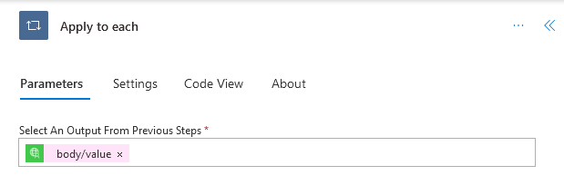
- Inside the Apply to each, add an action
	- Select **Control** > **Condition**
	  This is an if-statement.
	- In the Condition Parameters:
		- Choose `state` from previous step. 
		- "is not equal to" for the operator.
		- "active" as the value.
		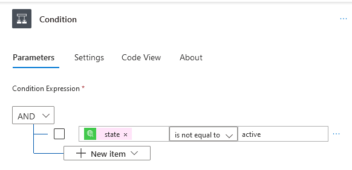
- Under the "True" condition, add an action
	- Select Microsoft Teams > Post message in a chat or channel.
	- Post as: Flow bot
	- Post in: Channel
	- Team: IT Alerts
	- Channel: Intune Alerts
	- Message: Write and format what you want for your alert message.

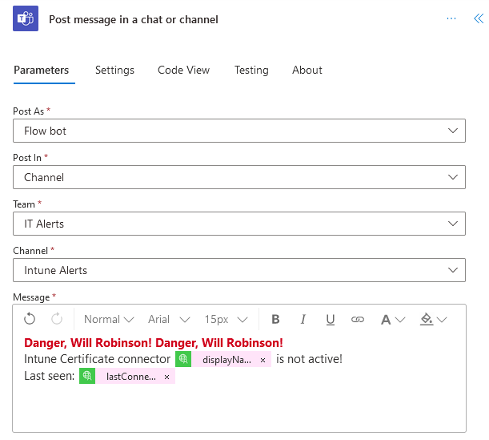

- Save the flow and give it a test!

Of course, my Intune Certificate Connector is running perfectly well, so the flow completed without issue.  
So lets break it! Connect to the server running your Intune Certificate Connector and stop the service(s).  
I'm not sure which one, so I stopped them all.
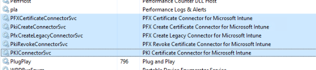
Wait a little while and you'll see in Intune Admin Center > Tenant administration > Connectors and tokens | Certificate connectors, that the status of the connector is now "Error"

Run the flow test again.  
We can see in the run history the condition was True, so it should have posted in Teams...
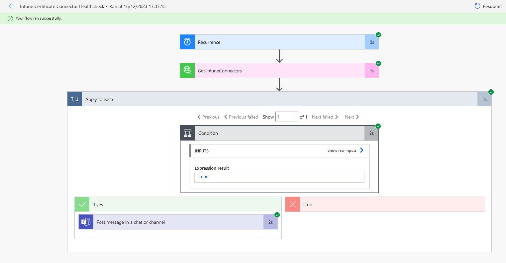

Teams:
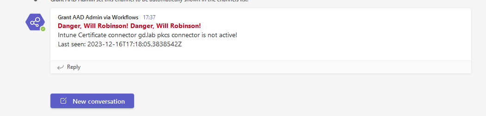

My face:

# Additions
There are other connectors you can use this for too. For example:  

**Intune Connector for Active Directory**  
Graph URI: `https://graph.microsoft.com/beta/deviceManagement/domainJoinConnectors`  
Condition: `state` is not equal to "active"  

**Managed Google Play Sync Status**  
Graph URI: `https://graph.microsoft.com//beta/deviceManagement/androidManagedStoreAccountEnterpriseSettings`  
Condition: `lastAppSyncStatus` is not equal to "success"  

---
# Resources
Add Power Apps Community Plan to your developer tenant.  
https://pnp.github.io/blog/post/how-to-enhance-your-dev-tenant-to-unleash-the-full-potential-of/  

Building a custom connector for working with delegated permissions against Microsoft Graph  
https://lowcodelewis.com/blog/building-a-custom-connector-for-working-with-delegated-permissions-against-microsoft-graph  

Using a custom connector for device management actions in Microsoft Intune.  
https://www.petervanderwoude.nl/post/using-a-custom-connector-for-device-management-actions-in-microsoft-intune/  

Using Power Automate to notify admins on Intune Connector health
https://techcommunity.microsoft.com/t5/intune-customer-success/using-power-automate-to-notify-admins-on-intune-connector-health/ba-p/2274944